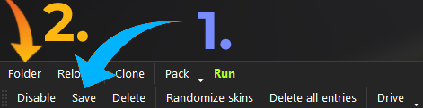

## **Adding Cars To Assetto Server**

Follow these steps to add cars to your Assetto Corsa server hosted on Wake Servers.

---

### **Step 1: Select Your Server**
1. Log in to your **Wake Servers Game Panel**.
2. Click on your Assetto Corsa server.


---

### **Step 2: Navigate to `server_cfg.ini`**
1. Click on the **Files** tab.


2. Open the `cfg` folder.


3. Locate and click on the `entry_list.ini` file.


Inside the `entry_list.ini` file, you should see cars listed in this format:

```
[CAR_0]
MODEL=ks_mazda_mx5_cup
SKIN=00_official
SPECTATOR_MODE=0
DRIVERNAME=
TEAM=
GUID=
BALLAST=0
RESTRICTOR=0
```

These lines specify the current cars and their configuration.

---

### **Step 3: Make Sure Your Cars Are Downloaded**
To find a new cars, you can use trusted sources such as [OverTake.gg](https://www.overtake.gg/). 

**Drag and Drop Your Map:**  
Once you've downloaded your cars, drag and drop them into **Content Manager**. 

Click on the drop down at the top right then click install.  


---

### **Step 4: Enable the Server Tab in Content Manager**
If the **Server** tab isn’t visible, follow these steps to enable it:
1. Open **Content Manager**.
2. Go to **Settings** > **Content Manager** > **Appearance**.
3. Check the box next to **Server** under **Links**.


---

### **Step 5: Adding the cars in Content Manager**
1. Navigate to the **Server** tab in Content Manager.
2. Click on the |***+***| at the bottem right to make a new server.
3. Then select **ENTRY LIST** In the bar menu.
4. The Press the |***+***| To add new cars.


### **Step 5.1: Adding your cars**
1. After pressing the |***+***| buttion you can choose the cars that you want and then click add at the bottem of the window.
2. After pressing the |***+***| buttion you can choose the cars that you want and then click add at the bottem of the window.

!!! warning "Warning"
    Make sure that you do not add more cars then the server you bought can handle. **For example if you have a 16 slots server dont add more then 16 cars.**


---

### **Step 6: Update `entry_list.ini` with your New Cars**
1. On the bottem left of your server in **Content Manager**, ***Click save***
2. Then click on the Folder



2. Open the entry_list.ini file and you should see something like this, For example:

```
[CAR_0]
MODEL=ks_lamborghini_huracan_gt3
SKIN=0_Racing_green
SPECTATOR_MODE=0
DRIVERNAME=
TEAM=
GUID=
BALLAST=0
RESTRICTOR=0

[CAR_1]
MODEL=ks_lamborghini_huracan_gt3
SKIN=0_Racing_green
SPECTATOR_MODE=0
DRIVERNAME=
TEAM=
GUID=
BALLAST=0
RESTRICTOR=0
```
Copy what you have in the entry_list.ini

1. Go back to the **Wake Servers Game Panel**.
2. Update the `entry_list.ini` file under `cfg` file under the **Files** tab.


---

### **Step 7: Start the Server**
1. Save your changes to the `server_cfg.ini` file.
2. Return to the **Console** tab in the Wake Servers Game Panel.
3. Click **Start** to launch your server with the new map.


---

## **Summary**
- Locate and update the `entry_list.ini` file in your game panel.
- Use Content Manager to select new cars to add.
- Copy the entry list from Content Manager.
- Paste it into the entry_list.ini on the Webpanel