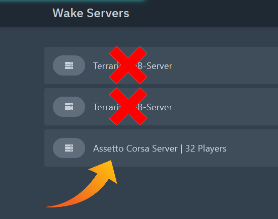
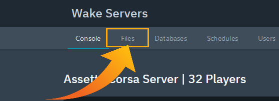
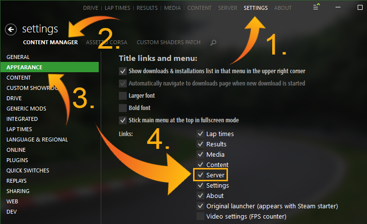

## **Changing the Map in Assetto Corsa**

Follow these steps to change the map (track) for your Assetto Corsa server hosted on Wake Servers.

---

### **Step 1: Select Your Server**
1. Log in to your **Wake Servers Game Panel**.
2. Click on your Assetto Corsa server.



---

### **Step 2: Navigate to `server_cfg.ini`**
1. Click on the **Files** tab.



2. Open the `cfg` folder.


3. Locate and click on the `server_cfg.ini` file.


Inside the `server_cfg.ini` file, locate the following lines:

```ini
TRACK                          = csp/1937/../imola
CONFIG_TRACK                   = 
```

These lines specify the current map and its configuration.

---

### **Step 3: Find Your Desired Map**
To find a new map, you can use trusted sources such as [OverTake.gg](https://www.overtake.gg/). 

**Drag and Drop Your Map:**  
Once you've downloaded your map, drag and drop it into **Content Manager**. Here's a helpful GIF showing this process:  


---

### **Step 4: Enable the Server Tab in Content Manager**
If the **Server** tab isn’t visible, follow these steps to enable it:
1. Open **Content Manager**.
2. Go to **Settings** > **Content Manager** > **Appearance**.
3. Check the box next to **Server** under **Links**.



---

### **Step 5: Change the Map in Content Manager**
1. Navigate to the **Server** tab in Content Manager.
2. Click on the current map (default map) to open the map selection menu.
3. Select your new map from the list or browse to it.


4. Once you've selected the map, click **OK** and **SAVE** the changes.

---

### **Step 6: Update `server_cfg.ini` with the New Map**
1. Open the `server_cfg.ini` file in Content Manager or on the server.
2. Copy the `TRACK` and `CONFIG_TRACK` values for your new map. For example:

```ini
TRACK                          = ks_nurburgring
CONFIG_TRACK                   = layout_gp_a
```

3. Go back to the **Wake Servers Game Panel**.
4. Update the `TRACK` and `CONFIG_TRACK` values in the `server_cfg.ini` file under the **Files** tab.


---

### **Step 7: Start the Server**
1. Save your changes to the `server_cfg.ini` file.
2. Return to the **Console** tab in the Wake Servers Game Panel.
3. Click **Start** to launch your server with the new map.


---

## **Summary**
- Locate and update the `server_cfg.ini` file in your game panel.
- Use Content Manager to select and apply the new map.
- Start your server to load the changes.
