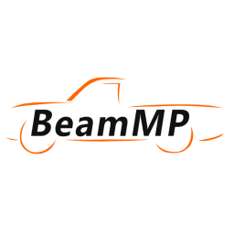
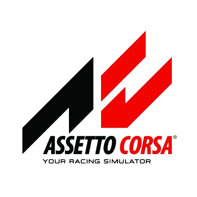

# Welcome to our Knowledgebase 

If you have not bought a server yet go to [Wakeserver.com](https://wakeservers.com).

---

## Featured Guides

Here are some guides to help you get started quickly:

- [How to Install Mods on BeamMP Servers](beammp/installing-mods.md)
- [How to Upload Minecraft Server Mods](minecraft/upload-mods.md)

## Select a Game to Get Started:

- ### <a href="beammp" style="font-size: 1.25em; color: orange; text-decoration: none;"><code>BeamMP Documentation</code></a> 

- ### <a href="assetto-corsa" style="font-size: 1.25em; color: orange; text-decoration: none;"><code>Assetto Corsa Documentation</code></a> 

---

## Quick Links

- [Contact Support](https://wakeserver.com/support)
- [Game Panel](https://panel.wakeservers.com/auth/login)
- [Billing Panel](https://billing.wakeservers.com/index.php?rp=/login)

---

### Need Help?

- [Join our Discord Community](https://discord.com/invite/yourdiscordlink)
- [Contact Support](https://wakeserver.com/support)