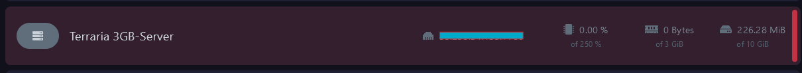
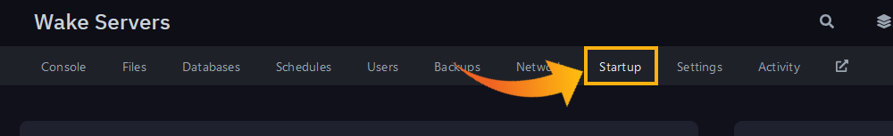
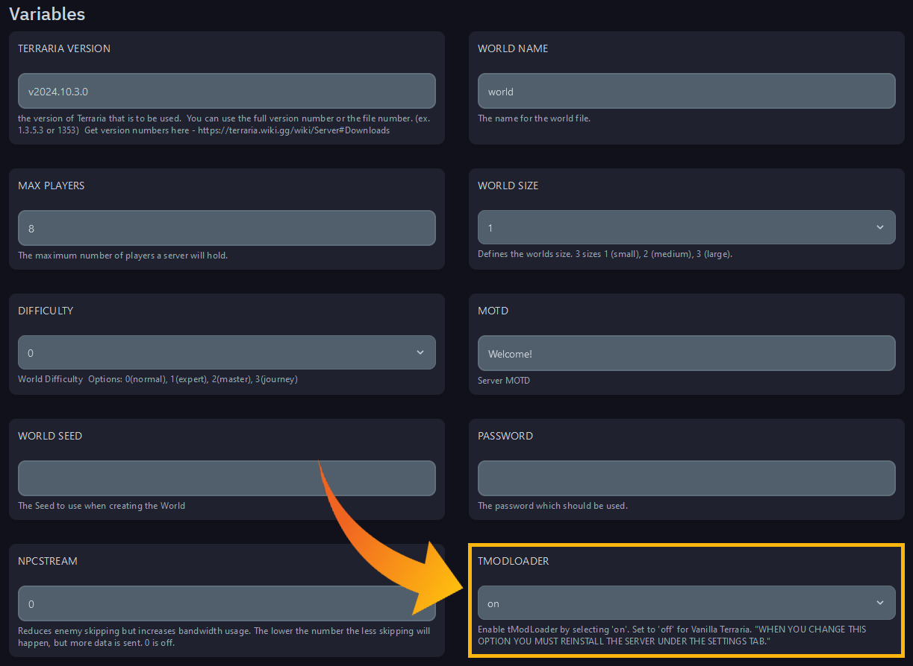
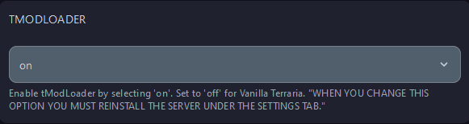
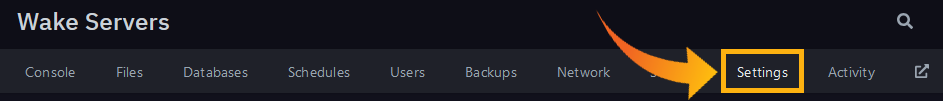
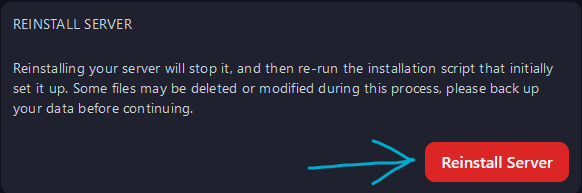

## **Adding Cars To Assetto Server**

Follow these steps to enable tModLoader for Terraria server hosted at Wake Servers.

---

### **Step 1: Select Your Server**
1. Log in to your **Wake Servers Game Panel**.
2. Click on your Assetto Corsa server.

---

### **Step 2: Navigate to `Startup Tab`**
1. Click on the **Files** tab.

2. Scroll down to the **`tModLoader`** option.

---

### **Step 3: Turn On tModLoader And Reinstall Your Server**
1. Turn **on** tModLoader.

2. Go to the **Settings** tab.

3. Scroll down to **Reinstall Server** Section.

---

### **Step 4: Start the Server**
1. Save your changes to the `server_cfg.ini` file.
2. Return to the **Console** tab in the Wake Servers Game Panel.
3. Click **Start** to launch your server with the new map.

---

## **Summary**
- Select Your Server.
- Navigate to `Startup Tab`
- Turn On tModLoader And Reinstall Your Server
- Start the Server